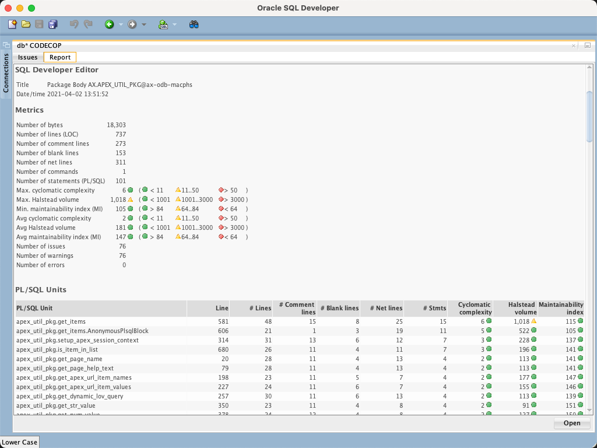

# db* CODECOP for SQL Developer

## Introduction

[db\* CODECOP for SQL Developer](https://github.com/Trivadis/plsql-cop-sqldev) is a **free extension** to check an editor content for compliance violations of this coding guideline. The extension may be parameterized to your preferred set of rules and allows checking this set against a program unit.

db\* CODECOP calculates metrics per PL/SQL unit, such as:

- McCabe’s cyclomatic complexity
- Halstead’s volume
- The maintainability index
- Lines
- Commands (SQL\*Plus and SQL)
- Statements (within a PL/SQL unit)
- etc.

And aggregates them on file level.

The results are presented in an additional tabbed panel. One tab shows all guideline violations to quickly navigate to the corresponding code position. The other tab contains a full HTML report, which also may be opened in your external browser.

## Examples

Open an Oracle PL/SQL or SQL script in a SQL Developer editor and press Ctrl-Shift-C to check your code against the Trivadis PL/SQL & SQL guidelines.

Navigate through the issues using the cursor keys to highlight the related code section in the linked editor.

Dock the db\* CODECOP output window on your favorite position within SQL Developer and click on the report tab to reveal some additional metrics. Open the report in an external browser to print or save the report.

