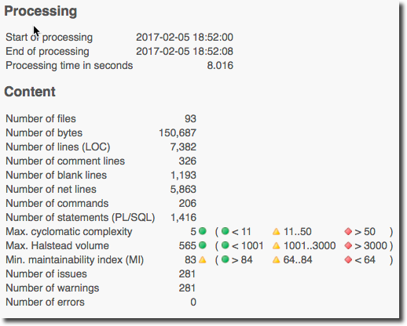
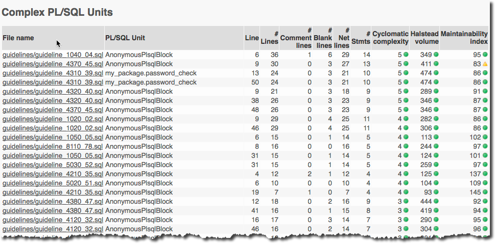

# db* CODECOP Command Line

## Introduction

[Trivadis db\* CODECOP](https://github.com/Trivadis/plsql-cop-cli) is a command line utility to check Oracle SQL*Plus files for compliance violations of this coding guideline.

Furthermore McCabe’s cyclomatic complexity, Halstead’s volume, the maintainability index and some other software metrics are calculated for each PL/SQL unit and aggregated on file level.

The code checking results are stored in XML, HTML and Excel files for further processing.

To get the most out of this command line utility you should make it part of your Continuous Integration environment by using the [db\* CODECOP for SonarQube](https://github.com/Trivadis/plsql-cop-sonar) plugin. This way you may control the quality of your code base over time.

Have also a look at [db\* CODECOP for SQL Developer](https://github.com/Trivadis/plsql-cop-sqldev) if you are interested to check the code quality of PL/SQL code within SQL Developer. It’s a free extension.

db\* CODECOP supports custom validators. We provide some [example validators in this GitHub repository](https://github.com/Trivadis/plsql-cop-validators). You may use these validators as is or amend/extend them to suit your needs.

## Examples

Here are some screen shot taken from an of an HTML report based on the samples provided with db\* CODECOP.

These [HTML](https://trivadis.github.io/plsql-cop-cli/tvdcc_report.html) and [Excel](https://trivadis.github.io/plsql-cop-cli/tvdcc_report.xlsx) reports have been created by db\* CODECOP and are based on a simple set of good and bad example files distributed with db\* CODECOP.
